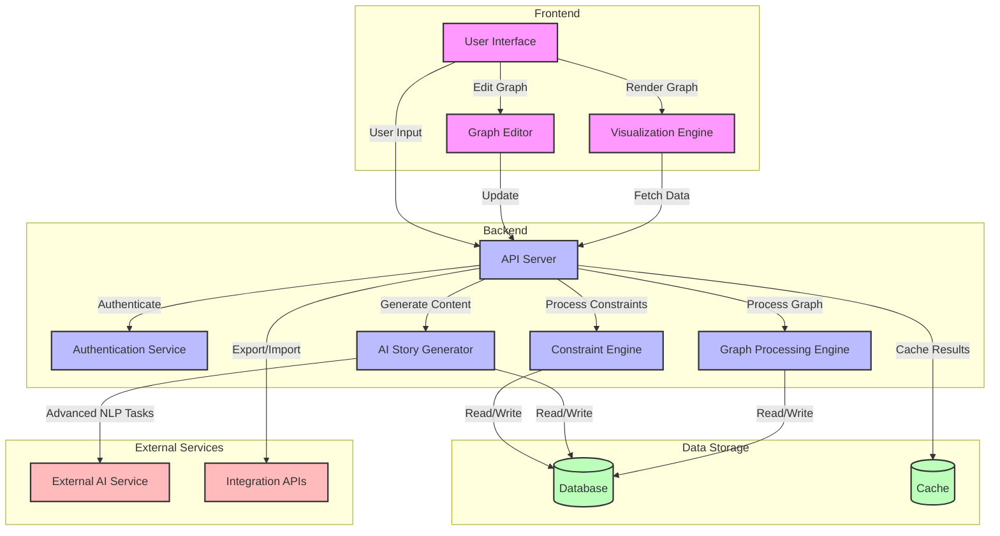

Product Requirements Document: Narrative Architect V1

This PRD outlines the key requirements for Narrative Architect V1, focusing on the core features of interactive narrative graph editing, constraint systems, and AI-assisted story generation. It provides a clear roadmap for development while allowing for future expansion and refinement based on user feedback and evolving needs in the storytelling and game development industries.

## 1. Product Overview

 1.1. Product Name: Narrative Architect 

 1.2. Version: 1.0 

 1.3. Purpose: An interactive story structure design tool for writers, game designers, and storytellers to create, visualize, and validate complex narrative structures. 

## 2. User Stories
### 2.1: Interactive Narrative Graph
#### 2.1.1: User Story: 

 As a writer, I want to visualize my narrative structure so that I can see how different story elements connect and interact. 

 Acceptance Criteria:  
2.1.1.1 The narrative graph updates in real-time as I add nodes and edges.  
2.1.1.2 I can click on nodes to view details such as content and metadata.  
2.1.1.3 I can drag and drop nodes to rearrange them without losing connections. 

#### 2.1.2: User Story: 

 As a game designer, I want to apply constraints to my narrative so that I can ensure it follows established storytelling rules. 

 Acceptance Criteria:  
2.1.2.1 I can select predefined constraints or create custom ones.  
2.1.2.2 The system alerts me if I violate any defined constraints when generating a narrative.  
2.1.2.3 I can view a list of all constraints applied to the current narrative.  

#### 2.1.3: User Story: 

 As a game developer, I want the system to generate story elements based on player interactions so that I can create engaging and dynamic narratives. 

 Acceptance Criteria:  
2.1.3.1 The system generates dialogue and plot points based on current narrative context.  
2.1.3.2 Generated content aligns with the constraints set by the user.  
2.1.3.3 I can modify generated content to better fit my vision.  

## 3. Technical Specifications

 3.1. Frontend  

Technologies:  
3.1.1.1 Styling: TBD  
3.1.1.2 Visualization: TBD  
3.1.1.3 Graph Editor: TBD  

 Features:  
3.1.2.1 Interactive drag-and-drop interface for manipulating narrative graphs  
3.1.2.2 Real-time updates and visualization of story constraints  
3.1.2.3 User-friendly forms for defining custom constraints  

### 3.2. Backend

 Technologies:  
3.2.1.1 API Server: TBD  
3.2.1.2 Authentication Service: TBD  
3.2.1.3 Constraint Engine: TBD  
3.2.1.4 AI Story Generator: TBD  
3.2.1.5 Graph Processing Engine: TBD  

 Features:  
3.2.2.1 API endpoints for fetching, saving, and modifying narrative graphs  
3.2.2.2 AI-driven content generation logic  
3.2.2.3 Constraint validation logic to ensure narrative coherence  

### 3.3. Database Structure

 Schema: 

3.3.1.1 StoryNode: id (PK), content, metadata  
3.3.1.2 StoryEdge: from_node (FK), to_node (FK), weight  
3.3.1.3 UserConstraints: id (PK), constraint_type, parameters  

### 3.4. API Design

 3.4.1.1 Endpoints:  
3.4.1.1. GET /api/narratives  
3.4.1.2. POST /api/narratives  
3.4.1.3. PUT /api/narratives/{id}  
3.4.1.4. DELETE /api/narratives/{id}  
3.4.1.5. GET /api/constraints  
3.4.1.6. POST /api/constraints  
3.4.1.7. GET /api/generate 

 3.4.2 Authentication: TBD 

## 4. Feature Requirements
#### 4.1. Narrative Graph Editor

 4.1.1. Allow users to create, edit, and delete story nodes and edges  
4.1.2. Provide a visual representation of the narrative structure  
4.1.3. Enable real-time updates of the graph as changes are made 

### 4.2. Constraint System

 4.2.1. Offer predefined constraint templates (e.g., Hero's Journey, Three-Act Structure)  
4.2.2. Allow users to create custom constraints  
4.2.3. Implement a constraint checking system that validates the narrative structure in real-time 

##### 4.3. AI-Assisted Story Generation

 Develop an AI model capable of generating story elements based on existing narrative structure and constraints  
Implement a user interface for triggering and controlling AI-generated content  
Allow users to edit and refine AI-generated content 

##### 4.4. Collaboration Features

 Implement multi-user editing capabilities  
Develop a version control system for narrative structures 

##### 4.5. Export and Integration

 Provide export options for various formats (JSON, XML, PDF report)  
Develop an API for integration with other writing and game development tools 

## 5. Non-Functional Requirements
##### 5.1. Performance

 The application should handle narrative graphs with up to 1000 nodes without significant lag  
AI-generated content should be produced within 5 seconds of request 

##### 5.2. Scalability

 The system should support up to 10,000 concurrent users 

##### 5.3. Security

 Implement encryption for all data in transit and at rest   Ensure user data privacy and provide options for anonymized story generation 

##### 5.4. Usability

 The user interface should be intuitive, requiring no more than 1 hour of onboarding for new users  
Implement an interactive tutorial system and contextual help 

## 6. Constraints
### 6.1. Timeline

 V1 should be completed within 6 months from project kickoff 

### 6.2. Budget

 Development budget is capped at $500,000 for V1 

### 6.3. Technology

 The application must be web-based and accessible via modern browsers (Chrome, Firefox, Safari, Edge) 

## 7. Milestones

 7.1. Alpha Release (Month 3): Core narrative graph editing features  
7.2. Beta Release (Month 5): Constraint system and basic AI-assistance  
7.3. V1 Release (Month 6): Full feature set including collaboration and export options 

## 8. Potential Architecture

This diagram shows the following components and their relationships:
### Frontend:
- User Interface: The main interface for user interactions
- Visualization Engine: Renders the narrative graph
- Graph Editor: Allows users to modify the narrative structure
### Backend:
- API Server: Handles all requests from the frontend
- Authentication Service: Manages user authentication and authorization
- Constraint Engine: Processes and enforces narrative constraints
- AI Story Generator: Generates story elements and content
- Graph Processing Engine: Handles graph-related computations
### Data Storage:
- Database: Stores narrative structures, user data, and constraints
- Cache: Improves performance by caching frequent queries
### External Services:
- External AI Service: For advanced NLP tasks or additional AI capabilities
- Integration APIs: For exporting/importing data to other tools

### Flow of Data and Interactions:
The arrows show the flow of data and interactions between components. This architecture allows for scalability, separation of concerns, and integration with external services. 
The frontend communicates with the backend via the API server, which then coordinates with various backend services to process requests, generate content, and manage data.

## Citations:
[1] https://access.articulate.com/support/article/System-Requirements-for-Articulate-Replay-360
[2] https://www.reddit.com/r/gamedesign/comments/1045rj5/best_software_to_start_with_narrative_design/